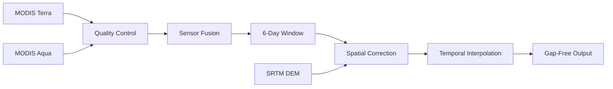

<style>
  .md-typeset h1 {
    display: none;
  }
</style>

<div align="center" markdown>

# **SnowMapPy**

### Precision Snow Cover Mapping from MODIS Data

[](https://pypi.org/project/SnowMapPy/)
[](https://www.python.org/downloads/)
[](https://opensource.org/licenses/MIT)
[](https://pepy.tech/project/snowmappy)

*A high-performance Python package for processing MODIS NDSI snow cover data from Google Earth Engine with scientifically validated gap-filling algorithms.*

[Get Started :material-arrow-right:](installation.md){ .md-button .md-button--primary }
[View on GitHub :material-github:](https://github.com/haytamelyo/SnowMapPy){ .md-button }

</div>

---

## :snowflake: What is SnowMapPy?

**SnowMapPy** is a Python package designed for researchers and practitioners working with snow cover data. It implements a **6-day moving window gap-filling algorithm** that combines MODIS Terra and Aqua observations to produce continuous, cloud-free daily snow cover time series.

!!! success "Key Capabilities"
    
    - **Gap-Free Time Series**: Transform cloudy MODIS data into continuous daily observations
    - **Sensor Fusion**: Combine Terra (morning) and Aqua (afternoon) for maximum coverage
    - **Elevation-Aware**: DEM-based snow correction for high-altitude regions
    - **Memory Efficient**: Process 20+ years of data on machines with 8GB RAM
    - **Publication Ready**: Scientifically validated algorithms with full metadata

---

## :chart_with_upwards_trend: The Science Behind It

Snow cover mapping using satellite imagery faces a fundamental challenge: **cloud contamination**. On average, 50% of daily MODIS observations are obscured by clouds, making continuous monitoring impossible without gap-filling.

SnowMapPy addresses this using a multi-step approach:



The **6-day moving window** (3 days before + current + 2 days after) captures temporal snow dynamics while providing enough observations to fill most gaps.

---

## :rocket: Quick Example

```python
from SnowMapPy import process_modis_ndsi_cloud

# Process one year of snow cover data
result, counters = process_modis_ndsi_cloud(
    project_name="your-gee-project",
    shapefile_path="study_area.shp",
    start_date="2020-01-01",
    end_date="2020-12-31",
    output_path="./output",
    interpolation_method="nearest",
    spatial_correction_method="elevation_mean"
)

print(f"Processed {len(result.time)} days of gap-filled snow cover data")
```

??? example "Sample Output"
    
    ```
    SnowMapPy v1.0.0 | MODIS Snow Cover Gap-Filling
    
    Processing Parameters
    ---------------------
      Study area:          study_area.shp
      Date range:          2020-01-01 to 2020-12-31
      Output:              study_area_NDSI.zarr
      Target CRS:          EPSG:4326
      Interpolation:       nearest
      Spatial correction:  elevation_mean
    
    → Loading Terra data from Earth Engine...
    → Loading Aqua data from Earth Engine...
    → Loading DEM data from Earth Engine...
    → Clipping data to study area...
    → Applying spatio-temporal gap-filling algorithm...
    Processing MODIS time series: 100%|██████████| 359/359 [02:34<00:00]
    
    ============================================================
      Processing complete!
    ============================================================
    ```

---

## :sparkles: Key Features

<div class="grid cards" markdown>

-   :material-cloud-sync:{ .lg .middle } **Cloud Processing**

    ---

    Direct integration with Google Earth Engine eliminates local data storage requirements. Data is processed on the cloud and streamed efficiently.

-   :material-satellite-variant:{ .lg .middle } **Sensor Fusion**

    ---

    Combines Terra (10:30 AM) and Aqua (1:30 PM) observations for maximum daily coverage, prioritizing higher-quality morning observations.

-   :material-speedometer:{ .lg .middle } **Numba Acceleration**

    ---

    JIT-compiled interpolation kernels achieve **50-200x speedup** compared to scipy equivalents, enabling multi-decadal analysis.

-   :material-memory:{ .lg .middle } **Memory Efficient**

    ---

    Dask lazy loading and server-side reprojection minimize RAM usage. Process 20+ years on 8GB machines.

-   :material-archive:{ .lg .middle } **Optimized Storage**

    ---

    Zarr format with ZSTD compression provides fast access and ~60% compression. Float16 output reduces size by 50%.

-   :material-api:{ .lg .middle } **Modern API**

    ---

    Clean Python API with full type hints, comprehensive docstrings, and an interactive CLI for ease of use.

</div>

---

## :books: Documentation Overview

| Section | Description |
|---------|-------------|
| [**Installation**](installation.md) | Install SnowMapPy via pip, conda, or from source |
| [**Quick Start**](quickstart.md) | Get running in 5 minutes with a basic example |
| [**User Guide**](user-guide/index.md) | In-depth explanations of all features |
| [**API Reference**](api/index.md) | Complete API documentation with examples |
| [**Examples**](examples/index.md) | Real-world workflows and Jupyter notebooks |
| [**CLI Reference**](cli.md) | Command-line interface documentation |

---

## :medal_military: Scientific Foundation

SnowMapPy implements algorithms validated in peer-reviewed research for snow cover mapping in mountainous regions:

!!! quote "Related Publication"
    
    Bousbaa, M., Boudhar, A., Kinnard, C., Elyoussfi, H., Karaoui, I., Eljabiri, Y., Bouamri, H., & Chehbouni, A. (2024). **An accurate snow cover product for the Moroccan Atlas Mountains: Optimization of the MODIS NDSI index threshold and development of snow fraction estimation models.** *International Journal of Applied Earth Observation and Geoinformation*, 129, 103851.
    
    [:material-link: Read the paper](https://doi.org/10.1016/j.jag.2024.103851)

---

## :busts_in_silhouette: Authors

<div class="grid cards" markdown>

-   **Haytam Elyoussfi**

    ---

    Lead Developer
    
    :material-email: haytam.elyoussfi@um6p.ma

-   **Hatim Bechri**

    ---

    Co-Author
    
    :material-email: hatim.bechri@uqtr.ca

-   **Mostafa Bousbaa**

    ---

    Co-Author
    
    :material-email: Mostafa.bousbaa@um6p.ma

</div>

---

## :heart: Community & Support

- :material-github: [GitHub Issues](https://github.com/haytamelyo/SnowMapPy/issues) - Report bugs or request features
- :material-star: [Star the repo](https://github.com/haytamelyo/SnowMapPy) - Show your support!
- :material-account-group: [Contributing](contributing.md) - Help improve SnowMapPy

---

<div align="center" markdown>

**Made with :snowflake: for the snow hydrology research community**

</div>
