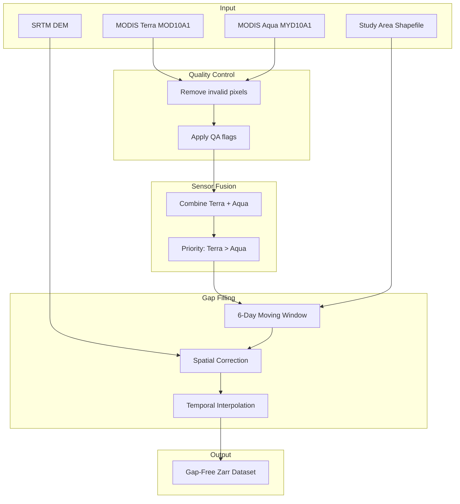

# User Guide

Welcome to the SnowMapPy User Guide. This section provides in-depth explanations of all features and concepts.

---

## What You'll Learn

This guide covers:

| Topic | Description |
|-------|-------------|
| [Algorithm Overview](algorithm.md) | The science behind the gap-filling process |
| [Interpolation Methods](interpolation.md) | Choosing the right gap-filling method |
| [Spatial Correction](spatial-correction.md) | DEM-based snow adjustments |
| [Memory Optimization](memory.md) | Processing large datasets efficiently |
| [Output Formats](output.md) | Understanding and using output data |

---

## Processing Pipeline

SnowMapPy implements a multi-stage processing pipeline:

---

## Quick Navigation

-   :material-chart-line:{ .lg .middle } **Algorithm**

    ---

    Understand the 6-day moving window gap-filling algorithm and sensor fusion strategy.
    
    [:octicons-arrow-right-24: Read more](algorithm.md)

-   :material-function:{ .lg .middle } **Interpolation**

    ---

    Compare nearest neighbor, linear, and cubic interpolation methods.
    
    [:octicons-arrow-right-24: Read more](interpolation.md)

-   :material-terrain:{ .lg .middle } **Spatial Correction**

    ---

    Learn how DEM-based elevation thresholds improve snow detection.
    
    [:octicons-arrow-right-24: Read more](spatial-correction.md)

-   :material-memory:{ .lg .middle } **Memory Optimization**

    ---

    Process multi-decadal datasets on limited hardware.
    
    [:octicons-arrow-right-24: Read more](memory.md)

-   :material-file-export:{ .lg .middle } **Output Formats**

    ---

    Work with Zarr output and export to other formats.
    
    [:octicons-arrow-right-24: Read more](output.md)

