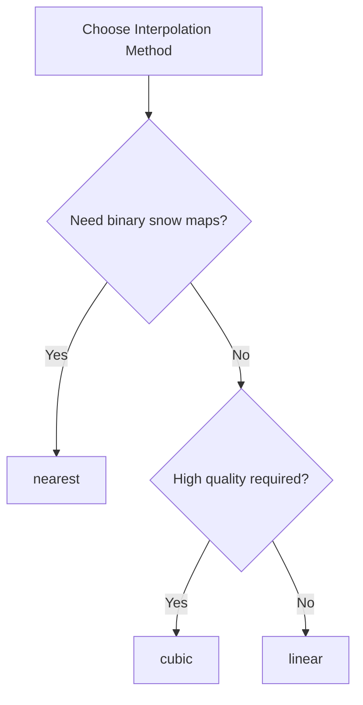

# Interpolation Methods

SnowMapPy offers three temporal interpolation methods for gap-filling. This guide helps you choose the right one.

---

## Overview

| Method | Speed | Smoothness | Use Case |
|--------|-------|------------|----------|
| **Nearest** | Fastest | Sharp | Binary snow/no-snow analysis |
| **Linear** | Fast | Moderate | General purpose |
| **Cubic** | Slower | Smooth | Continuous NDSI values |

---

## Nearest Neighbor (`"nearest"`)

The simplest method - uses the closest valid observation in time.

### How It Works

```
Day:    -3   -2   -1    0   +1   +2
Value:  45   --   --    ?   --   60
                        ↓
                       45   (closest to -1)
```

### Mathematical Definition

For target time $t$:

$$
\hat{v}_t = v_{t^*} \quad \text{where} \quad t^* = \arg\min_{i} |t - t_i|, \quad v_i \neq \text{NoData}
$$

### Characteristics

!!! success "Advantages"
    
    - **Fastest** - Minimal computation
    - **Preserves original values** - No artificial values created
    - **Works with any number of valid points** - Needs only 1 observation

!!! warning "Limitations"
    
    - **Discontinuous** - Can create abrupt changes
    - **No trend estimation** - Ignores temporal patterns

### Recommended For

- Binary snow/no-snow classification
- Categorical snow cover mapping
- Maximum processing speed
- When preserving exact observation values matters

### Usage

```python
result, counters = process_modis_ndsi_cloud(
    project_name="your-project",
    shapefile_path="study_area.shp",
    start_date="2020-01-01",
    end_date="2020-12-31",
    output_path="./output",
    interpolation_method="nearest"  # ← Nearest neighbor
)
```

---

## Linear Interpolation (`"linear"`)

Draws a straight line between valid observations to estimate gap values.

### How It Works

```
Day:    -3   -2   -1    0   +1   +2
Value:  40   --   --    ?   --   60
                        ↓
                       48   (linear between 40 and 60)
```

### Mathematical Definition

Given boundary values $v_a$ at time $t_a$ and $v_b$ at time $t_b$:

$$
\hat{v}_t = v_a + \frac{v_b - v_a}{t_b - t_a} (t - t_a)
$$

### Characteristics

!!! success "Advantages"
    
    - **Continuous** - Smooth transitions between observations
    - **Fast** - Simple computation
    - **Balanced** - Good trade-off between speed and quality

!!! warning "Limitations"
    
    - **Assumes linear change** - May not capture nonlinear melt/accumulation
    - **Requires 2 valid points** - Falls back to nearest if only 1 available

### Recommended For

- General-purpose gap filling
- When temporal continuity matters
- Moderate accuracy requirements
- Default choice for most applications

### Usage

```python
result, counters = process_modis_ndsi_cloud(
    project_name="your-project",
    shapefile_path="study_area.shp",
    start_date="2020-01-01",
    end_date="2020-12-31",
    output_path="./output",
    interpolation_method="linear"  # ← Linear interpolation
)
```

---

## Cubic Interpolation (`"cubic"`)

Fits a smooth cubic polynomial through valid observations.

### How It Works

```
Day:    -3   -2   -1    0   +1   +2
Value:  30   45   --    ?   --   60
                        ↓
                       52   (cubic polynomial fit)
```

### Mathematical Definition

Cubic spline interpolation using Catmull-Rom splines:

$$
\hat{v}_t = \sum_{i=0}^{3} c_i(t) \cdot v_i
$$

where $c_i(t)$ are the cubic basis functions.

### Characteristics

!!! success "Advantages"
    
    - **Smoothest** - Continuous first and second derivatives
    - **Captures curvature** - Better for nonlinear snow dynamics
    - **Highest quality** - Best for continuous NDSI analysis

!!! warning "Limitations"
    
    - **Slowest** - More computational overhead
    - **Requires 4 valid points** - Falls back to linear/nearest if fewer
    - **Can overshoot** - May produce values outside input range

### Recommended For

- High-quality NDSI time series
- Hydrological modeling inputs
- Snow melt rate estimation
- When smooth transitions are critical

### Usage

```python
result, counters = process_modis_ndsi_cloud(
    project_name="your-project",
    shapefile_path="study_area.shp",
    start_date="2020-01-01",
    end_date="2020-12-31",
    output_path="./output",
    interpolation_method="cubic"  # ← Cubic interpolation
)
```

---

## Visual Comparison

```
Original:   ●         ●         ○         ●         ○         ●
                       ↓         ↓
           
Nearest:    ●─────────●─────────●─────────●─────────●─────────●
                               (40)               (60)
           
Linear:     ●─────────●─────────●─────────●─────────●─────────●
                                ╲       ╱
                                 ╲     ╱
                                 (48)

Cubic:      ●─────────●─────────∿─────────●─────────∿─────────●
                               ╱  ╲     ╱  ╲
                              (52)   (58)
```

---

## Performance Benchmarks

Processing 20 years of daily data (7,300 time steps) over a 1000×1000 pixel area:

| Method | Processing Time | Relative Speed |
|--------|-----------------|----------------|
| Nearest | ~45 seconds | 1.0x (baseline) |
| Linear | ~60 seconds | 0.75x |
| Cubic | ~90 seconds | 0.5x |

!!! tip "All Methods Are Fast"
    
    Thanks to Numba JIT compilation, even cubic interpolation completes in reasonable time. Choose based on quality needs, not just speed.

---

## Fallback Behavior

When insufficient valid observations exist:

1. **Cubic** → Falls back to **Linear** (if 2-3 points)
2. **Linear** → Falls back to **Nearest** (if 1 point)
3. **Nearest** → Uses single available value
4. **No valid points** → Remains as gap (NoData)

---

## Recommendation Summary



**Default recommendation**: Start with `"linear"` for most applications.
