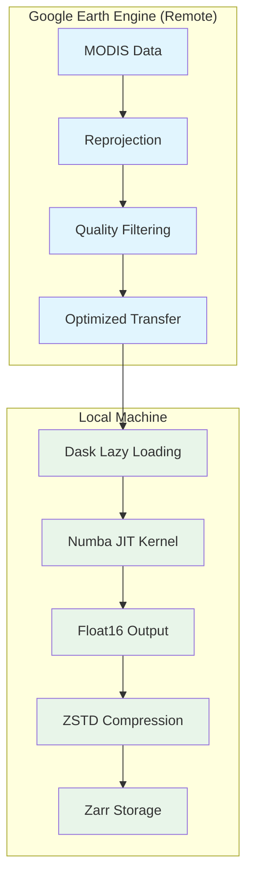

# Memory Optimization

Process large datasets efficiently with SnowMapPy's memory-optimized architecture.

---

## Overview

Processing multi-decadal MODIS time series can require significant memory. SnowMapPy implements several strategies to minimize RAM usage:

!!! success "Key Benefits"
    
    - Process **20+ years** of data on machines with **8GB RAM**
    - Handle **1000km×1000km** study areas efficiently
    - No intermediate files or temporary storage needed

---

## Memory Optimization Strategies

### 1. Server-Side Reprojection

Data reprojection happens on Google Earth Engine servers, not locally:

```python
# This happens on GEE servers
image = image.reproject(crs='EPSG:4326', scale=500)
# Only the final, reprojected data is transferred
```

!!! tip "Impact"
    
    - **50-70% reduction** in data transfer
    - No local memory spike during reprojection
    - Faster overall processing

### 2. Dask Lazy Loading

Data is loaded lazily using Dask, meaning computations are deferred until needed:

```python
import dask.array as da

# Data is not loaded into memory here
data = da.from_zarr('output.zarr')

# Still lazy - no memory used
yearly_mean = data.mean(dim='time')

# Only now is data actually loaded
result = yearly_mean.compute()
```

!!! tip "Impact"
    
    - Work with datasets larger than available RAM
    - Only load data chunks as needed
    - Automatic chunk optimization

### 3. Float16 Output

Results are stored in `float16` precision by default:

| Data Type | Bytes per Value | NDSI Range | Precision |
|-----------|-----------------|------------|-----------|
| float64 | 8 | 0-100 | Excessive |
| float32 | 4 | 0-100 | Good |
| **float16** | 2 | 0-100 | Sufficient |

!!! tip "Impact"
    
    - **50% reduction** in output file size
    - **50% reduction** in memory during processing
    - No loss of meaningful precision for NDSI (0-100 range)

### 4. ZSTD Compression

Zarr output uses ZSTD compression:

```python
# Typical compression ratios
Uncompressed: 1.0x
ZSTD level 3: ~0.4x (60% smaller)
```

!!! tip "Impact"
    
    - **60% reduction** in disk space
    - Fast decompression for analysis
    - Chunked access remains efficient

---

## Memory Usage Estimates

### Per Study Area Size

For 1 year of daily data (365 days):

| Area | Approximate Pixels | Peak RAM Usage |
|------|-------------------|----------------|
| 100km × 100km | 40,000 | ~1 GB |
| 500km × 500km | 1,000,000 | ~4 GB |
| 1000km × 1000km | 4,000,000 | ~8 GB |

### Per Time Range

For a 500km × 500km area:

| Time Range | Days | Peak RAM Usage |
|------------|------|----------------|
| 1 month | 31 | ~0.5 GB |
| 1 year | 365 | ~4 GB |
| 5 years | 1,825 | ~8 GB |
| 20 years | 7,300 | ~12 GB |

!!! warning "These Are Estimates"
    
    Actual memory usage depends on cloud cover (more gaps = more interpolation work), DEM complexity, and interpolation method.

---

## Best Practices

### 1. Process in Chunks

For very large datasets, process yearly or seasonally:

```python
import pandas as pd

# Define years to process
years = range(2000, 2023)

for year in years:
    result, counters = process_modis_ndsi_cloud(
        project_name="your-project",
        shapefile_path="study_area.shp",
        start_date=f"{year}-10-01",  # Water year start
        end_date=f"{year+1}-09-30",  # Water year end
        output_path="./output",
        output_name=f"snow_cover_{year}_{year+1}"
    )
    print(f"Completed {year}-{year+1}")
```

### 2. Monitor Memory

During processing, monitor your system's memory:

=== "Windows"
    ```powershell
    # Task Manager or Resource Monitor
    taskmgr
    ```

=== "Linux"
    ```bash
    # Real-time monitoring
    htop
    # Or snapshot
    free -h
    ```

=== "Python"
    ```python
    import psutil
    
    def print_memory():
        mem = psutil.virtual_memory()
        print(f"Used: {mem.used / 1e9:.1f} GB / {mem.total / 1e9:.1f} GB")
    ```

### 3. Close Other Applications

Before processing large datasets:

- Close memory-intensive applications (browsers, IDEs)
- Ensure adequate swap/pagefile space
- Consider running overnight for very large jobs

---

## Configuration Options

### Output Data Type

Control precision vs storage trade-off:

```python
result, counters = process_modis_ndsi_cloud(
    ...,
    output_dtype="float16"    # Default: smallest, fastest
    # output_dtype="float32"  # More precision
    # output_dtype="float64"  # Maximum precision
)
```

### Compression

Control compression level:

```python
result, counters = process_modis_ndsi_cloud(
    ...,
    compression="zstd"   # Default: good balance
    # compression="none" # Faster I/O, larger files
)
```

---

## Troubleshooting

### Out of Memory Errors

If you encounter `MemoryError`:

1. **Reduce study area size** - Split into tiles
2. **Reduce time range** - Process in yearly chunks
3. **Increase available RAM**:
   - Close other applications
   - Add more physical RAM
   - Increase swap/pagefile

### Slow Processing

If processing is slower than expected:

1. **Check network connection** - GEE data transfer depends on bandwidth
2. **Reduce interpolation complexity** - Use `"nearest"` instead of `"cubic"`
3. **Disable spatial correction** - Set `spatial_correction_method="none"`

---

## Architecture Diagram


