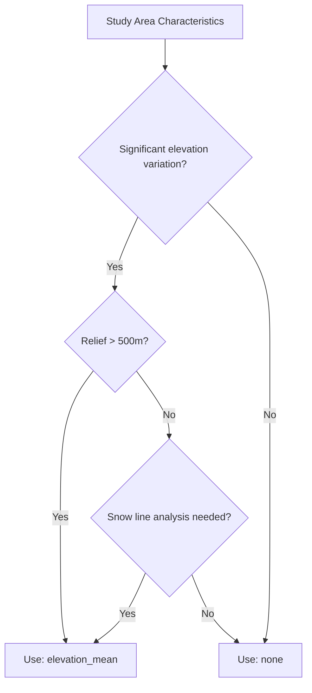

# Spatial Correction

DEM-based elevation correction improves snow detection accuracy in mountainous regions.

---

## Overview

In mountainous areas, snow distribution is strongly controlled by elevation. Spatial correction uses Digital Elevation Model (DEM) data to apply physically-based constraints to the gap-filling process.

!!! info "When to Use"
    
    Spatial correction is most valuable for:
    
    - High-relief regions (mountains, plateaus)
    - Areas with strong elevation gradients
    - Studies requiring elevation-specific snow analysis

---

## How It Works

The spatial correction algorithm:

1. **Loads SRTM DEM** at 30m resolution from Google Earth Engine
2. **Calculates elevation statistics** for the study area
3. **Applies elevation-based thresholds** during interpolation

### Elevation Mean Method

The `elevation_mean` method adjusts gap-filled values based on the relationship between pixel elevation and mean regional elevation:

```python
# Simplified logic
for each pixel:
    if elevation > regional_mean + threshold:
        # Higher elevation - favor snow presence
        adjust_toward_snow()
    elif elevation < regional_mean - threshold:
        # Lower elevation - favor snow absence
        adjust_toward_no_snow()
    else:
        # Mid-elevation - no adjustment
        keep_interpolated_value()
```

---

## Available Methods

### `"none"` - No Spatial Correction

Uses only temporal interpolation without elevation constraints.

```python
result, counters = process_modis_ndsi_cloud(
    project_name="your-project",
    shapefile_path="study_area.shp",
    start_date="2020-01-01",
    end_date="2020-12-31",
    output_path="./output",
    spatial_correction_method="none"  # ← Disabled
)
```

!!! tip "When to Use"
    
    - Flat or low-relief study areas
    - Areas without significant elevation gradients
    - Maximum processing speed required

### `"elevation_mean"` - Elevation Mean Correction

Applies DEM-based elevation thresholds to constrain gap-filled values.

```python
result, counters = process_modis_ndsi_cloud(
    project_name="your-project",
    shapefile_path="study_area.shp",
    start_date="2020-01-01",
    end_date="2020-12-31",
    output_path="./output",
    spatial_correction_method="elevation_mean"  # ← Enabled
)
```

!!! tip "When to Use"
    
    - Mountainous regions
    - Studies focused on snow line dynamics
    - When physical constraints improve accuracy

---

## DEM Data Source

SnowMapPy uses the **SRTM Digital Elevation Model** from Google Earth Engine:

| Property | Value |
|----------|-------|
| Dataset | USGS/SRTMGL1_003 |
| Resolution | 30 meters |
| Coverage | Global (60°S to 60°N) |
| Vertical accuracy | ~16m (absolute) |

!!! note "Server-Side Processing"
    
    DEM resampling and reprojection happen on GEE servers, minimizing data transfer and local memory usage.

---

## Technical Details

### Algorithm Steps

1. **DEM Loading**
   ```python
   # Pseudocode
   dem = ee.Image("USGS/SRTMGL1_003")
   dem_clipped = dem.clip(study_area)
   ```

2. **Statistics Calculation**
   ```python
   stats = dem_clipped.reduceRegion(
       reducer=ee.Reducer.mean().combine(
           ee.Reducer.stdDev(), sharedInputs=True
       )
   )
   dem_mean = stats['elevation_mean']
   dem_std = stats['elevation_stdDev']
   ```

3. **Threshold Definition**
   ```python
   high_threshold = dem_mean + dem_std
   low_threshold = dem_mean - dem_std
   ```

4. **Correction Application**
   ```python
   # During gap-filling kernel
   if pixel_elevation > high_threshold:
       if surrounding_high_elevation_pixels_have_snow:
           interpolated_value = adjust_toward_snow(interpolated_value)
   ```

### Numba Implementation

The spatial correction is implemented in the JIT-compiled kernel:

```python
@njit
def apply_spatial_snow_correction(
    interpolated_data,  # 3D: (time, y, x)
    dem_data,           # 2D: (y, x)
    dem_mean,
    dem_std,
    window_size=3
):
    """Apply elevation-based snow correction."""
    # Implementation handles edge cases and applies
    # physically-consistent constraints
    ...
```

---

## Performance Impact

| Correction Method | Additional Processing Time |
|-------------------|---------------------------|
| `none` | Baseline |
| `elevation_mean` | ~10-15% slower |

!!! info "Why the Overhead?"
    
    Additional time comes from:
    
    - DEM data loading from GEE
    - Elevation statistics calculation
    - Spatial neighborhood analysis during gap-filling

---

## Validation

Spatial correction has been validated to improve accuracy in:

- **High Atlas Mountains, Morocco** - 5-8% reduction in commission errors
- **Alpine regions** - Better snow line detection
- **Transitional elevations** - Reduced noise at forest-alpine boundary

---

## Recommendation



**Default recommendation**: Use `"elevation_mean"` for mountainous regions, `"none"` for flat areas.
